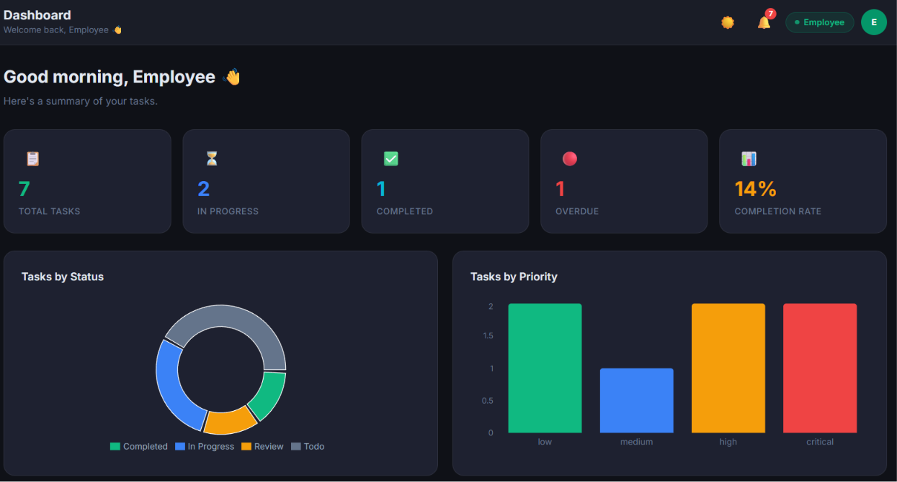
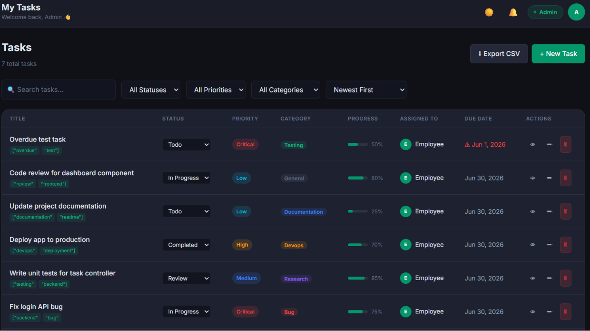
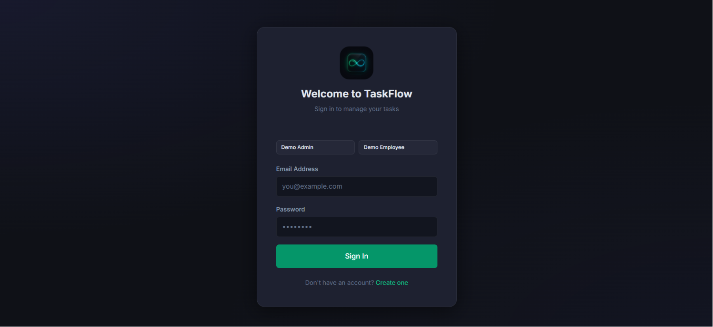
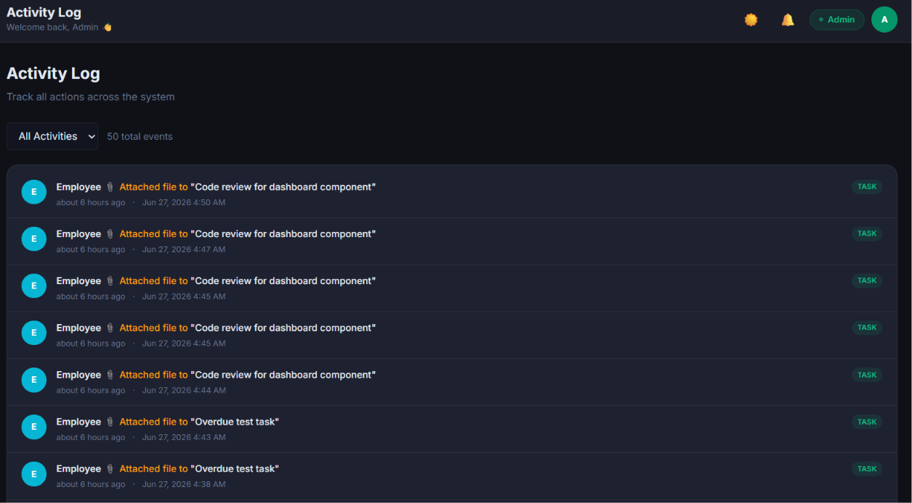

<div align="center">


# TaskFlow

**A production-ready task management system with role-based access control**

[](https://react.dev)
[](https://nodejs.org)
[](https://mongodb.com)
[](https://expressjs.com)
[](https://vitejs.dev)
[](https://cloudinary.com)

[🚀 Live Demo](https://task-flow-xi-hazel.vercel.app) · [📡 API Health](https://taskflow-backend-a0x2.onrender.com/api/health) · [🐛 Report Bug](https://github.com/yo-soy-dev/TaskFlow/issues)

</div>

---

## Overview

TaskFlow is a full-stack MERN application built for teams to create, assign, and track tasks efficiently. It enforces a strict two-tier permission model — admins control everything, employees manage their own workload — backed by JWT authentication, bcrypt password hashing, and server-side role guards on every protected route.

The project is deployed on Vercel (frontend) and Render (backend), with MongoDB Atlas as the cloud database and Cloudinary for file storage.

---

## Screenshots

| Dashboard | Task List |
|---------|---------|
|  |  | 

| Login Page | Activity Log |
|---------|---------|
|---|---------|---------|
|  |  | 

| Login Page | Activity Log |
|---|---------|---------|
|  |  |

---

## Features

| | Feature | Details |
|---|---------|---------|
| 🔐 | JWT Authentication | Stateless token-based auth with 7-day expiry |
| 👥 | Role-Based Access Control | Strict Admin / Employee permission enforcement |
| 📊 | Live Dashboard | Recharts-powered task statistics and breakdowns |
| ✅ | Full Task CRUD | Create, view, edit, delete with server-side validation |
| 🔍 | Search, Filter & Pagination | Multi-field filtering with server-side pagination |
| 👤 | User Management | Admin can create, edit, and deactivate accounts |
| 💬 | Task Comments | Threaded discussion with edit and delete support |
| 📎 | File Attachments | Upload PDFs and images via Cloudinary |
| 📋 | Activity Log | Immutable audit trail of all system actions |
| 🔔 | Notification System | Real-time bell with unread count and mark-as-read |
| 📊 | Task Progress Tracker | 0–100% slider per task |
| 🏷️ | Categories & Tags | Organize tasks with labels and custom tags |
| ⬇️ | CSV Export | One-click spreadsheet download |
| 🌙 | Dark / Light Mode | Persisted theme preference |
| 📱 | Responsive UI | Optimized for mobile, tablet, and desktop |

---

## Demo Credentials

| Role | Email | Password |
|------|-------|----------|
| 👑 Admin | admin@taskflow.com | admin123 |
| 👤 Employee | employee@taskflow.com | emp123456 |

---

## System Architecture

```
┌─────────────────────────────────────────────────────────────────┐
│                        CLIENT (React 18)                        │
│   AuthContext → Axios Interceptor → React Router v6 Guards      │
└───────────────────────────┬─────────────────────────────────────┘
                            │  HTTPS + Bearer Token
                            ▼
┌─────────────────────────────────────────────────────────────────┐
│                    EXPRESS.JS API SERVER                        │
│                                                                 │
│  Request → morgan → cors → express.json                        │
│         → protect() [JWT verify]                               │
│         → adminOnly() [Role check]                             │
│         → express-validator [Input validation]                 │
│         → Controller → Mongoose → MongoDB Atlas                │
│                                                                 │
│  Error → errorHandler middleware → JSON response               │
└──────┬────────────────────────────────────┬────────────────────┘
       │                                    │
       ▼                                    ▼
┌─────────────┐                   ┌──────────────────┐
│  MongoDB    │                   │   Cloudinary     │
│  Atlas      │                   │   (File Storage) │
│             │                   │                  │
│  Users      │                   │  PDFs / Images   │
│  Tasks      │                   │  raw + image     │
│  Comments   │                   │  resource types  │
│  Activity   │                   └──────────────────┘
│  Notifs     │
└─────────────┘
```

### JWT Authentication Flow

```
1. POST /api/auth/login  →  validate credentials
2. bcrypt.compare()      →  verify password hash
3. jwt.sign()            →  generate 7-day token
4. Client stores token   →  localStorage
5. Axios interceptor     →  attaches Authorization: Bearer <token>
6. protect() middleware  →  jwt.verify() on every protected route
7. req.user              →  injected for downstream use
```

### RBAC Enforcement

```
Request hits route
       │
       ▼
  protect()          ← validates JWT, sets req.user
       │
       ▼
  adminOnly()?       ← checks req.user.role === 'admin'
       │                  if employee → 403 Forbidden
       ▼
  Controller         ← employee scope applied in query
                        (only sees own tasks)
```

### Cloudinary Upload Flow

```
Frontend selects file
       │
       ▼
multer (memoryStorage) → buffer in req.file
       │
       ▼
uploadToCloudinary()
  ├── mimetype check → resource_type: 'image' | 'raw'
  ├── upload_stream → Cloudinary API
  └── returns { secure_url, public_id }
       │
       ▼
Attachment saved to Task.attachments[]
       │
       ▼
secure_url stored → served directly from Cloudinary CDN
```

---

## Security

| Layer | Implementation |
|-------|---------------|
| Password hashing | bcryptjs with salt rounds 12 |
| Authentication | JWT HS256, 7-day expiry, Bearer scheme |
| Authorization | Role guard middleware on every admin route |
| Input validation | express-validator on all POST/PUT routes |
| Error handling | Centralized handler — no stack traces in production |
| CORS | Origin whitelist via `CLIENT_URL` env variable |
| File uploads | Mimetype whitelist + 10MB size limit via multer |
| Token invalidation | Client-side removal on 401 response via Axios interceptor |

---

## How It Works

- User logs in → server issues a signed JWT → client stores it and attaches it to every request via Axios interceptor
- `protect()` middleware decodes and verifies the token on every protected route, injecting `req.user`
- `adminOnly()` middleware blocks non-admin requests before they reach the controller
- Controllers apply role-based query scoping — employees only see tasks assigned to or created by them
- File uploads go through multer (in-memory), then stream directly to Cloudinary; only the `secure_url` is stored in MongoDB
- Every create/update/delete action writes an entry to the `Activity` collection and creates a `Notification` for affected users
- The frontend polls `/api/notifications` every 30 seconds to surface unread counts in the bell icon

---

## Why This Project

**Engineering decisions worth noting:**

- **Stateless JWT over sessions** — horizontally scalable, no server-side session store needed
- **Mongoose subdocuments for attachments** — avoids a separate collection for a one-to-many relationship that never needs independent querying
- **Centralized error handler** — single `errorHandler` middleware normalizes Mongoose errors, JWT errors, and validation errors into a consistent JSON shape
- **Activity log as append-only** — no updates or deletes on the `Activity` model; this preserves audit integrity
- **Polling over WebSockets** — chosen for simplicity within the 48-hour scope; the architecture supports a WebSocket upgrade without restructuring
- **Memory storage for uploads** — avoids disk I/O on serverless/ephemeral environments; buffers go straight to Cloudinary

---

## Getting Started

### Prerequisites

- Node.js v18+
- MongoDB (local or [Atlas](https://www.mongodb.com/atlas))
- [Cloudinary](https://cloudinary.com) account (free tier works)

### 1. Clone

```bash
git clone https://github.com/yo-soy-dev/TaskFlow.git
cd TaskFlow
```

### 2. Backend setup

```bash
cd backend
npm install
cp .env.example .env
```

```env
PORT=5000
MONGO_URI=your_mongodb_connection_string
JWT_SECRET=your_secret_key_min_32_chars
JWT_EXPIRE=7d
NODE_ENV=development
CLIENT_URL=http://localhost:5173

CLOUDINARY_CLOUD_NAME=your_cloud_name
CLOUDINARY_API_KEY=your_api_key
CLOUDINARY_API_SECRET=your_api_secret
```

### 3. Seed demo data

```bash
node seed.js
```

### 4. Frontend setup

```bash
cd ../frontend
npm install
```

### 5. Run

```bash
# Terminal 1
cd backend && npm run dev      # → http://localhost:5000

# Terminal 2
cd frontend && npm run dev     # → http://localhost:5173
```

---

## Project Structure

```
TaskFlow/
├── backend/
│   ├── config/
│   │   ├── db.js                    # MongoDB connection
│   │   └── cloudinary.js            # Cloudinary config + upload helpers
│   ├── controllers/
│   │   ├── authController.js
│   │   ├── taskController.js        # CRUD + attachments + CSV export
│   │   ├── userController.js
│   │   ├── commentController.js
│   │   ├── notificationController.js
│   │   └── activityController.js
│   ├── middleware/
│   │   ├── auth.js                  # protect() + adminOnly()
│   │   ├── errorHandler.js          # Centralized error normalization
│   │   ├── validate.js              # express-validator runner
│   │   └── upload.js                # multer memoryStorage config
│   ├── models/
│   │   ├── User.js
│   │   ├── Task.js                  # Includes attachments subdoc
│   │   ├── Comment.js
│   │   ├── Notification.js
│   │   └── Activity.js
│   ├── routes/
│   │   ├── authRoutes.js
│   │   ├── taskRoutes.js
│   │   ├── userRoutes.js
│   │   ├── commentRoutes.js
│   │   ├── notificationRoutes.js
│   │   └── activityRoutes.js
│   ├── utils/
│   │   ├── jwt.js
│   │   ├── response.js              # sendResponse / sendError helpers
│   │   └── activity.js             # logActivity + createNotification
│   ├── seed.js
│   └── server.js
│
└── frontend/src/
    ├── components/
    │   ├── common/                  # Layout, Modal, Pagination, Badge
    │   ├── tasks/                   # TaskForm, AttachmentSection
    │   ├── comments/                # CommentSection
    │   ├── notifications/           # NotificationBell
    │   └── users/                   # UserForm
    ├── context/AuthContext.js       # Global auth state + token management
    ├── hooks/useTheme.js            # Dark/light mode with localStorage
    ├── pages/
    │   ├── DashboardPage.jsx
    │   ├── TasksPage.jsx
    │   ├── UsersPage.jsx
    │   ├── ActivityPage.jsx
    │   ├── LoginPage.jsx
    │   ├── RegisterPage.jsx
    │   └── ProfilePage.jsx
    └── services/api.js             # Axios instance + all API methods
```

---

## API Reference

### Auth `/api/auth`

| Method | Endpoint | Access | Description |
|--------|----------|--------|-------------|
| POST | `/register` | Public | Register a new user |
| POST | `/login` | Public | Login and receive a JWT |
| GET | `/me` | Private | Get own profile |
| PUT | `/me` | Private | Update own profile |
| PUT | `/change-password` | Private | Change password |

### Tasks `/api/tasks`

| Method | Endpoint | Access | Description |
|--------|----------|--------|-------------|
| GET | `/` | Private | List tasks — search, filter, paginate |
| GET | `/stats` | Private | Aggregated task statistics |
| GET | `/export` | Private | Download tasks as CSV |
| GET | `/:id` | Private | Get a single task |
| POST | `/` | Admin | Create a task |
| PUT | `/:id` | Private | Update a task |
| DELETE | `/:id` | Admin | Delete a task |
| POST | `/:id/attachments` | Private | Upload a file |
| DELETE | `/:id/attachments/:aid` | Private | Remove a file |
| GET | `/:id/comments` | Private | List comments |
| POST | `/:id/comments` | Private | Add a comment |

### Comments `/api/comments`

| Method | Endpoint | Access | Description |
|--------|----------|--------|-------------|
| PUT | `/:id` | Owner / Admin | Edit a comment |
| DELETE | `/:id` | Owner / Admin | Delete a comment |

### Users `/api/users` _(Admin only)_

| Method | Endpoint | Description |
|--------|----------|-------------|
| GET | `/` | List all users |
| GET | `/:id` | Get a user |
| GET | `/:id/tasks` | Get a user's tasks |
| POST | `/` | Create a user |
| PUT | `/:id` | Update a user |
| DELETE | `/:id` | Delete a user |

### Notifications `/api/notifications`

| Method | Endpoint | Description |
|--------|----------|-------------|
| GET | `/` | Get my notifications |
| PUT | `/read-all` | Mark all as read |
| PUT | `/:id/read` | Mark one as read |
| DELETE | `/:id` | Delete a notification |

### Activity `/api/activity`

| Method | Endpoint | Description |
|--------|----------|-------------|
| GET | `/` | Get the activity log |

---

## Tech Stack

**Backend**

| Package | Purpose |
|---------|---------|
| Express.js | REST API framework |
| MongoDB + Mongoose | Database and ODM |
| jsonwebtoken | JWT signing and verification |
| bcryptjs | Password hashing (rounds: 12) |
| express-validator | Schema-level input validation |
| cloudinary | Cloud file storage |
| multer | Multipart file parsing (memory storage) |
| morgan | HTTP request logging |

**Frontend**

| Package | Purpose |
|---------|---------|
| React 18 | UI library |
| React Router v6 | Client-side routing with guards |
| Axios | HTTP client with interceptors |
| Recharts | Dashboard charts |
| React Hot Toast | Toast notifications |
| date-fns | Date formatting |

---

## Deployment

| Service | Role | URL |
|---------|------|-----|
| Vercel | Frontend hosting | [task-flow-xi-hazel.vercel.app](https://task-flow-xi-hazel.vercel.app) |
| Render | Backend API | [taskflow-backend-a0x2.onrender.com](https://taskflow-backend-a0x2.onrender.com) |
| MongoDB Atlas | Cloud database | — |
| Cloudinary | File storage CDN | — |

---

## Assignment Checklist

- [x] JWT Authentication (Login / Register)
- [x] Role-Based Access Control (Admin & Employee)
- [x] Dashboard with statistics and charts
- [x] Complete Task CRUD with validation
- [x] User Management (Admin only)
- [x] Search, Filter & Pagination
- [x] Proper REST API structure
- [x] Centralized error handling
- [x] Responsive UI (mobile + tablet + desktop)
- [x] Clean folder structure and reusable components
- [x] Database seeder for demo data
- [x] Environment variable configuration

**Bonus**

- [x] Task Comments with edit / delete
- [x] File Attachments via Cloudinary
- [x] Task Progress % tracker
- [x] Categories and Tags
- [x] Notification System with unread count
- [x] Audit Activity Log
- [x] CSV Export
- [x] Dark / Light Mode

---

## Future Improvements

- **WebSockets** — replace 30s polling with Socket.io for true real-time notifications
- **Redis caching** — cache `/api/tasks/stats` and paginated lists to reduce DB load
- **Rate limiting** — add `express-rate-limit` on auth endpoints to prevent brute force
- **Unit & integration tests** — Jest + Supertest for controller and middleware coverage
- **Dockerization** — `docker-compose.yml` for one-command local setup
- **Email notifications** — Nodemailer / SendGrid for task assignment emails
- **Refresh tokens** — short-lived access tokens with secure httpOnly refresh token rotation

---

<div align="center">

Built with ❤️ by [Soy-Yo-Dev](https://github.com/yo-soy-dev)

</div>
